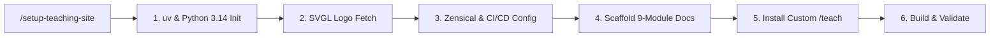

# ⚡ Agent Skills Library

A curated collection of production-grade skills for AI coding assistants such as [Antigravity](https://github.com), [Claude Code](https://claude.ai), [Cursor](https://cursor.com), and [Gemini CLI](https://github.com).

Built following the **[writing-for-agents](https://github.com/mattpocock/skills)** principles — tight completion criteria, zero-drift context pointers, and deterministic execution sequences.

---

## 📦 Featured Skills

| Skill | Category | Description |
| :--- | :--- | :--- |
| [**`setup-teaching-site`**](#setup-teaching-site) | `productivity` | Scaffolds a complete [Zensical](https://zensical.org) learning portal with [SVGL](https://svgl.app) branding and sets up a custom `/teach` environment. |
| [**`teach`**](#teach) | `productivity` | Interactive teacher skill with ADR-style learning records, cheatsheets, debugging playbooks, and Mermaid diagrams. |

---

## 🚀 Featured Showcase: `setup-teaching-site`

Transform an empty directory into a full-featured, deployable interactive masterclass workspace in seconds.



### What it sets up

- 🏛️ Zensical documentation site: clean typography, light/dark themes, code copy buttons, search highlighting, and Mermaid runtime diagrams. (https://zensical.org)
- 🎨 SVGL vector branding: fetches SVG logos and configures theme icons and favicons. (https://svgl.app)
- 📚 Comprehensive masterclass structure:
  - docs/index.md — portal home with interactive roadmap
  - docs/mission.md — topic compass (Why, success criteria, constraints)
  - docs/lessons/index.md — progressive modules with checkbox tracking
  - docs/cheatsheet/index.md — quick-reference syntax and command tables
  - docs/debugging/index.md — diagnostic playbooks
  - docs/interview/index.md — interview question banks
  - docs/references/ — curated resources and glossary
  - learning-records/ — ADR-style learning records
  - NOTES.md — pedagogical preferences and scratch notes
- 🤖 Custom `/teach` skill: configured for the site (pagination, Mermaid visualization, sidebar navigation)
- 🚀 Automated GitHub Pages CI/CD: ready-to-deploy `.github/workflows/docs.yml` (uses astral-sh/setup-uv)

### Usage

Run the skill from your agent with the following invocation:

```
/setup-teaching-site "<Topic>" ["<Site Title>"] ["<Site URL>"]
```

Example:

```
/setup-teaching-site "Kubernetes" "Kubernetes & Cloud-Native Architecture Masterclass" "https://rohit1024.github.io/learn-k8s"
```

---

## 📥 Installation

### Method 1 — Global installation (available in every project)

Clone or copy skills to your global agent skills directory:

```bash
# Clone this repository
git clone https://github.com/<your-username>/skills.git ~/skills

# Symlink or copy any skill globally
mkdir -p ~/.gemini/skills
cp -r ~/skills/skills/productivity/setup-teaching-site ~/.gemini/skills/
```

### Method 2 — Project-specific installation

Install directly into your target workspace:

```bash
mkdir -p .agents/skills/setup-teaching-site
curl -sSL https://raw.githubusercontent.com/<your-username>/skills/main/skills/productivity/setup-teaching-site/SKILL.md -o .agents/skills/setup-teaching-site/SKILL.md
```

### Method 3 — Via skills-lock.json

Add the skill entry to your project's `skills-lock.json`:

```json
{
  "setup-teaching-site": {
    "source": "<your-username>/skills",
    "sourceType": "github",
    "skillPath": "skills/productivity/setup-teaching-site/SKILL.md",
    "computedHash": "<COMPUTED_SHA256_HASH>"
  }
}
```

---

## 📂 Repository layout

```
skills/
├── README.md
└── skills/
    └── productivity/
        └── setup-teaching-site/
            ├── SKILL.md                     # Main operational orchestrator
            ├── SVGL-INTEGRATION.md          # SVGL logo retrieval & path bindings
            ├── ZENSICAL-CONFIG-TEMPLATE.md  # zensical.toml & GitHub Actions CI
            ├── CURRICULUM-TEMPLATES.md      # docs portal templates & catalogs
            ├── TEACH-SKILL-TEMPLATE.md      # Custom /teach skill & format specs
            └── agents/
                └── openai.yaml              # Agent manifest & policy
```

---

## 🛠️ Principles for writing skills

All skills in this repository follow the writing-for-agents standards:

1. Context load vs cognitive load: user-invoked skills may set `disable-model-invocation: true` to avoid unnecessary token use during unrelated turns.
2. Progressive disclosure: templates and detailed formats live in sibling `.md` files and are referenced via explicit context pointers.
3. Strict completion criteria: each step defines a checkable, unambiguous completion condition.
4. Leading words & positive phrasing: use explicit action verbs (scaffold, retrieve, catalog, verify).

---

## 🙏 Credits & acknowledgments

- Zensical — https://zensical.org
- SVGL — https://svgl.app
- Matt Pocock — https://github.com/mattpocock (inspiration for the agent skills framework)

---

## 📄 License

MIT © Rohit Kharche — https://github.com/rohit1024
