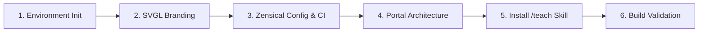

# Setup Teaching Site

Initialize a complete, deployable interactive teaching workspace powered by [Zensical](https://zensical.org) and configured with the enhanced `/teach` skill.

This creates an environment optimized for deep learning: a Zensical documentation portal with visual diagrams (Mermaid), curated cheatsheets, debugging playbooks, interview question banks, ADR-style learning records, and GitHub Pages deployment.

---

## Scaffolding Sequence

Follow this sequence in order. Each step ends on a strict completion criterion that must be verified before moving to the next.



---

### Step 1: Collect Inputs & Initialize Python Environment

1. Extract the topic, site title, and repository details from user arguments or prompt the user if omitted:
   - **Topic**: e.g., `Kubernetes`, `Rust`, `Kafka`, `Distributed Systems`
   - **Site Name**: e.g., `Learn Kubernetes Architecture`
   - **Author / GitHub Handle**: e.g., `rohit1024`
   - **Site URL**: e.g., `https://<github-handle>.github.io/<repo-name>`
2. Initialize the project with `uv`:
   ```bash
   uv init --no-pin-python --python ">=3.14" .
   uv add --dev "zensical>=0.0.55"
   ```
3. Add `.gitignore` entries:
   ```gitignore
   .venv/
   site/
   .cache/
   __pycache__/
   *.pyc
   .DS_Store
   ```

> **Completion Criterion**: `pyproject.toml` contains `zensical` in `dev` dependencies, `.venv` is generated, and `uv run zensical --version` executes cleanly.

---

### Step 2: Retrieve Branding & SVG Logo from SVGL

Zensical sites require dedicated theme icons and favicons.

1. Query [SVGL](https://svgl.app) or the upstream repository `pheralb/svgl` on GitHub for the topic's SVG logo:
   - Endpoint: `https://raw.githubusercontent.com/pheralb/svgl/main/static/library/<slug>.svg`
   - Example slugs: `kubernetes`, `rust`, `docker`, `python`, `go`, `spring`, `react`, `typescript`, `postgresql`, `redis`, `kafka`, `aws`, `google-cloud`.
2. Create directories:
   ```bash
   mkdir -p overrides/.icons/custom overrides/.icons/svgl docs/assets
   ```
3. Fetch the SVG and place it into all three designated paths:
   - `overrides/.icons/custom/<topic-slug>.svg`
   - `overrides/.icons/svgl/<topic-slug>.svg`
   - `docs/assets/<topic-slug>-logo.svg`
4. If no network or exact match exists, craft a clean, high-contrast SVG badge matching the format described in [SVGL-INTEGRATION.md](SVGL-INTEGRATION.md).

> **Completion Criterion**: `overrides/.icons/custom/<topic-slug>.svg` and `docs/assets/<topic-slug>-logo.svg` exist and contain valid XML `<svg>` markup.

---

### Step 3: Configure `zensical.toml` & GitHub Actions CI/CD

1. Create `zensical.toml` at the project root using the production template in [ZENSICAL-CONFIG-TEMPLATE.md](ZENSICAL-CONFIG-TEMPLATE.md):
   - Set `site_name`, `site_description`, `site_author`, `site_url`, and `copyright`.
   - Set `favicon = "assets/<topic-slug>-logo.svg"`.
   - Set `custom_dir = "overrides"`.
   - Set `[project.theme.icon] logo = "custom/<topic-slug>"`.
   - Enable PyMdown extensions: superfences with Mermaid support (`pymdownx.superfences`), admonitions, code copy buttons, search highlight, and custom icons path (`options.custom_icons = ["overrides/.icons"]`).
   - Define clean top-level `nav` structure (never leak individual lessons into `zensical.toml`).
2. Create `.github/workflows/docs.yml` for automated GitHub Pages deployment upon pushing to `main` / `master`.

> **Completion Criterion**: `zensical.toml` and `.github/workflows/docs.yml` are written and free of syntax errors.

---

### Step 4: Scaffold Documentation Portal Hierarchy

Create the standard teaching portal folder structure and initial index files using templates in [CURRICULUM-TEMPLATES.md](CURRICULUM-TEMPLATES.md):

```text
docs/
├── assets/
│   └── <topic-slug>-logo.svg
├── cheatsheet/
│   └── index.md
├── debugging/
│   └── index.md
├── interview/
│   └── index.md
├── lessons/
│   └── index.md
├── references/
│   ├── index.md
│   ├── resources.md
│   └── glossary.md
├── index.md
└── mission.md
learning-records/
NOTES.md
```

1. **`docs/index.md`**: Master portal home with quick navigation cards, Mermaid curriculum roadmap flowchart, and immediate starter link.
2. **`docs/mission.md`**: Mission compass with Why, Success Looks Like, Constraints, and Out of Scope.
3. **`docs/lessons/index.md`**: 6–9 progressive curriculum modules outlining 30–60 sequential lesson objectives with checkbox trackers.
4. **`docs/cheatsheet/index.md`**: Fast command, annotation, and syntax reference catalog.
5. **`docs/debugging/index.md`**: Diagnostic guide catalog for common runtime failures, race conditions, and error messages.
6. **`docs/interview/index.md`**: High-signal senior system design and technical interview question bank.
7. **`docs/references/`**:
   - `index.md`: Hub for external references and internal terms.
   - `resources.md`: Curated, annotated high-trust Knowledge & Wisdom resources.
   - `glossary.md`: Canonical nomenclature dictionary.
8. **`learning-records/`**: Directory for ADR-style decision records.
9. **`NOTES.md`**: Scratchpad capturing learner profile, pedagogical preferences, and active module state.

> **Completion Criterion**: All 10 documentation files exist, contain topic-tailored content with Mermaid diagrams, and resolve all relative markdown links without broken references.

---

### Step 5: Install the Custom `/teach` Skill & Format References

Install the enhanced `/teach` skill in the workspace at `.agents/skills/teach/` from [TEACH-SKILL-TEMPLATE.md](TEACH-SKILL-TEMPLATE.md).

1. Create directory:
   ```bash
   mkdir -p .agents/skills/teach/agents
   ```
2. Write `.agents/skills/teach/SKILL.md` (the comprehensive teaching workflow with strict Zensical navigation rules, mandatory Mermaid diagrams, bottom pagination requirements, and feedback loops).
3. Write format specifications:
   - `.agents/skills/teach/MISSION-FORMAT.md`
   - `.agents/skills/teach/LEARNING-RECORD-FORMAT.md`
   - `.agents/skills/teach/RESOURCES-FORMAT.md`
   - `.agents/skills/teach/GLOSSARY-FORMAT.md`
   - `.agents/skills/teach/agents/openai.yaml`

> **Completion Criterion**: `.agents/skills/teach/` contains `SKILL.md` and all 5 companion specification files.

---

### Step 6: Validate & Build the Site

1. Run Zensical build to verify configuration and asset links:
   ```bash
   uv run zensical build --clean
   ```
2. Verify that `site/index.html` and assets are generated with zero fatal errors.
3. Inform the user that the teaching environment is ready, present a summary of the scaffolded portal, and invite them to begin with `/teach`.

> **Completion Criterion**: `uv run zensical build --clean` exits with returncode 0 and produces the `site/` directory.

---

## Disclosed Reference & Templates

- [SVGL-INTEGRATION.md](SVGL-INTEGRATION.md): SVGL logo fetching, fallback generation, and icon overrides guide.
- [ZENSICAL-CONFIG-TEMPLATE.md](ZENSICAL-CONFIG-TEMPLATE.md): Complete `zensical.toml` and `.github/workflows/docs.yml` configurations.
- [CURRICULUM-TEMPLATES.md](CURRICULUM-TEMPLATES.md): Standard portal templates for all `docs/` catalogs, mission, and notes.
- [TEACH-SKILL-TEMPLATE.md](TEACH-SKILL-TEMPLATE.md): The full enhanced `/teach` skill files for `.agents/skills/teach/`.
